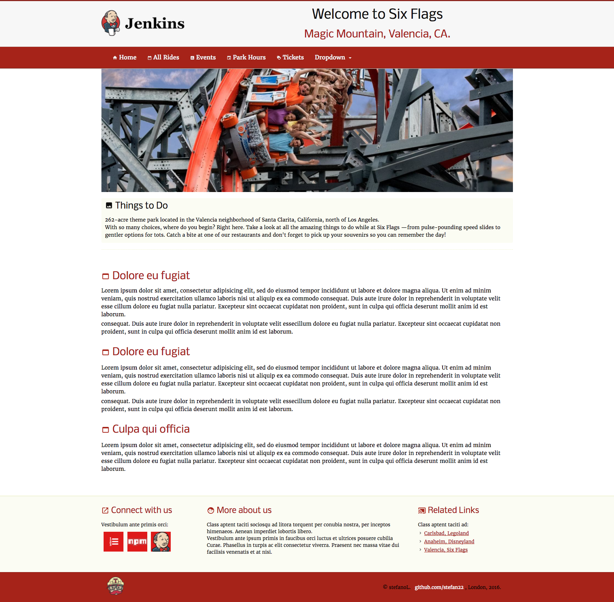
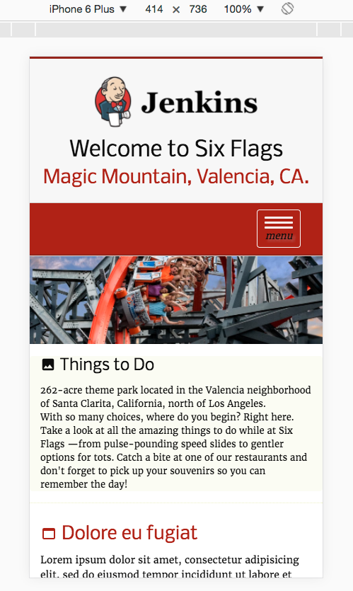
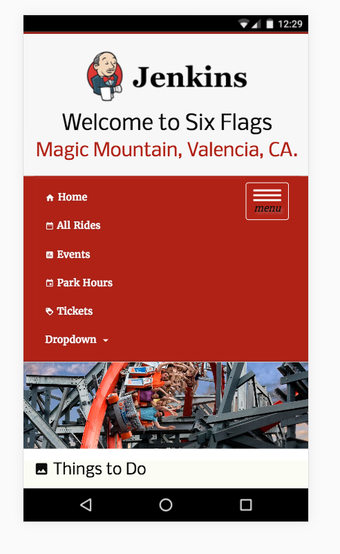
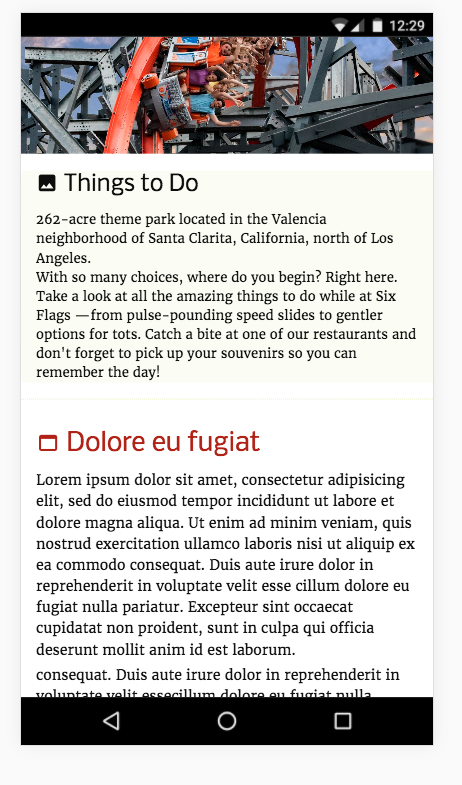
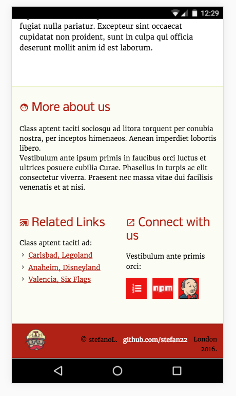
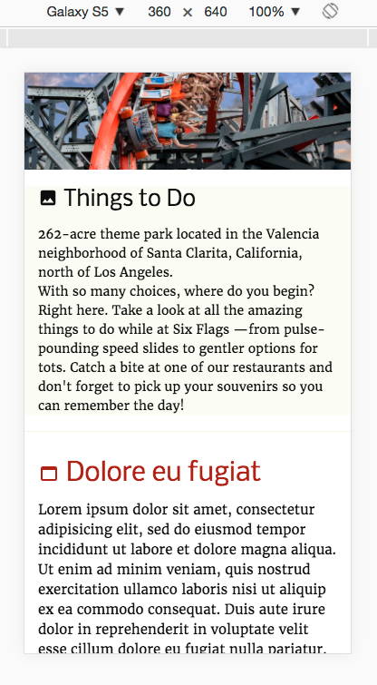
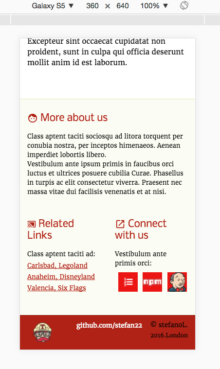
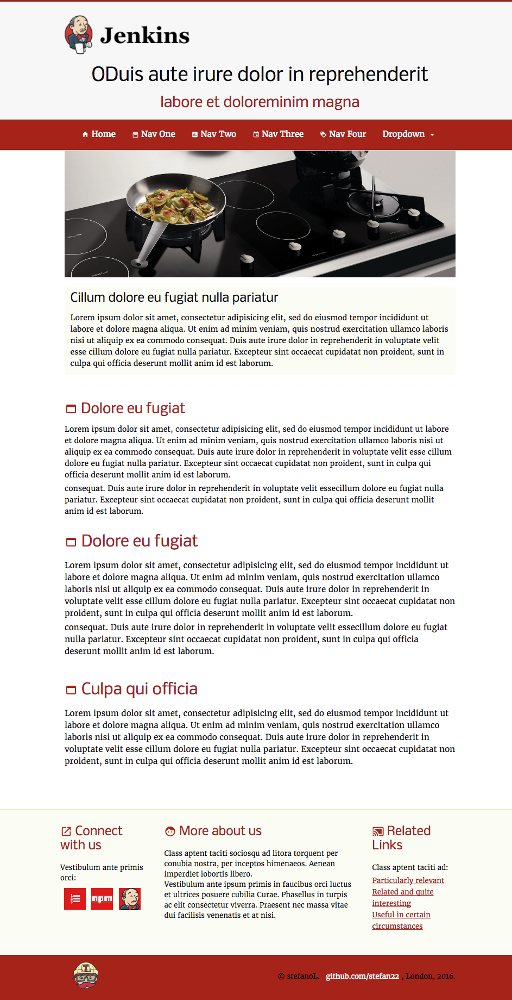

### grandGruntjs, SPA
- updated Gruntfile.js, package.json,bower.json,config.rb and Gemfile 
- rebuild navigation, and made some changes to page layout.
- added js skip navigation (when navigation comes before main content)
- sticky footer/ js screen resize dom event
- added partials w/compass
- added secondary font/ moved google fonts to sass folders.
- git clone then run grunt on terminal to load page to browser

  
   
  
  sixFlags desktop - click to zoom-in (100%)
  
  
  
  
  

  
   
  
  sixFlags iphone6 - see nexus sc3 for footer
  
  
  
  

  
   
  
  nexus sc1 
  
  
  

  
   
  
  nexus sc2
  
  
  

  
   
  
  nexus sc3 -iphone6 footer 
  
  
  

  
  
  

  
   
  
  galaxy S5 mid
  
  
  
  

  
   
  
  galaxy S5 footer
  
  
  
  
  
  

  
   
  
  @mixin tablet
  
  
  
  

  
   
  
  over 1200px
  
  

 

